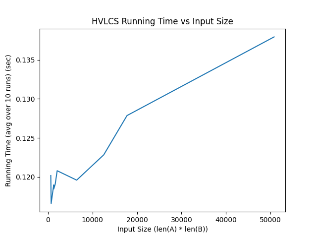

# Programming Assignment 3: Highest Value Longest Common Sequence

### Xabier Sienra (80213894)

### Hailey Pham (24752485)

# Instructions to run code

### Requirements

Python 3 is required to run all of the assignment code. The matplotlib library is required to run graph.py. Depending on your device, 'python' may need to be replaced with 'py' or 'python3' in the following commands.

### Input Format

The program takes in as input a text file in the following format:

```
K
x1 v1
x2 v2
...
xK vK
A
B
```

where `K` is an integer number of characters in the alphabet, each of the `xi`s is a single character, each of the `vi`s is a non-negative integer, and `A` and `B` are strings composed of the `xi`s.

### Output Format

The program outputs two lines:

- On the first line, the maximum common subsequence value
- On the second line, a common subsequence with this maximum value

The output will automatically be printed to the terminal, unless an output file is provided.

### Run Command

To run the program, use the following command:

```
python <PATH TO main.py> --input <PATH TO INPUT FILE> [--output <PATH TO OUTPUT FILE>]
```

If an output file path is not provided, the output will be printed to the terminal.

Examples:

```
python src/main.py --input tests/example.in
```

```
python src/main.py --input tests/example.in --output tests/example.out
```

## Question 1: Empirical Comparison

Use at least 10 nontrivial input files (i.e., contain strings of length at least 25). Graph the runtime of the 10 files.


## Question 2: Recurrence Equation

Give a recurrence that is the basis of a dynamic programming algorithm to compute the HVLCS of strings A and B. You must provide the appropriate base cases, and explain why your recurrence is correct.

$OPT(i,j)$ = maximum common subsequence value for the substrings $A_{1:i}$ and $B_{1:j}$

$$
OPT(i,j)=
\begin{cases}
0 & \quad \text{$i = 0 \wedge j = 0$}\\
\max\{OPT(i-1, j),\ OPT(i, j-1)\} & \quad a_i \neq b_j\\
v(a_i)+OPT(i-1, j-1)  & \quad a_i = b_j
\end{cases}
$$

## Question 3: Big-Oh

Give pseudocode of an algorithm to compute the length of the HVLCS of given strings A and B. What is the runtime of your algorithm?

```

```
